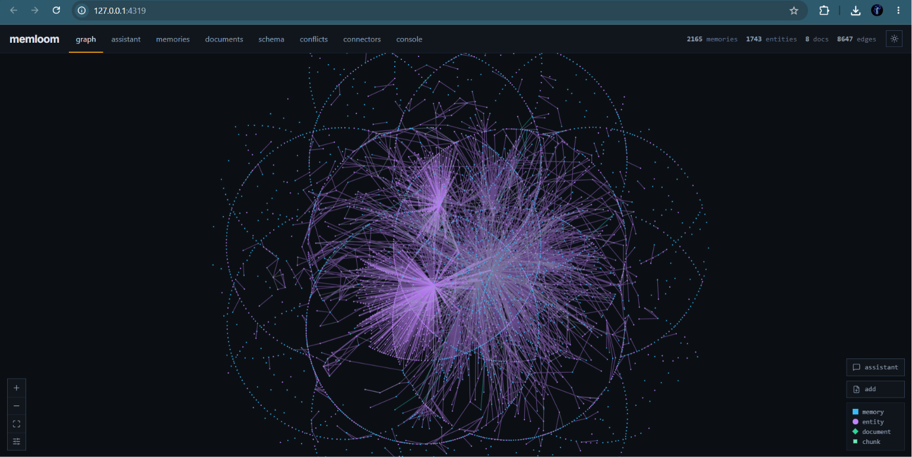

# memloom



**A local-first memory engine for AI agents that gives them a shared memory.**

Memloom is built to give your agents a shared memory that persists across sessions and tools. Import what your agents already learned, keep it fresh automatically, and recall it from any AI client in one query.

What that gets you:

- **One knowledge layer across every tool:** Claude Desktop, Claude Code, Cursor, Copilot,
  your own scripts: they all read and write the same store over MCP. Switch agents and the
  memory comes along.
- **Memory management:** When a new memory contradicts an
  old one, memloom keeps both and flags the conflict; you resolve it (or let the LLM
  resolve the obvious ones), and every decision is reversible.
- **Answers with citations:** "What did we decide about the deploy target" is one
  recall with the source cited, instead of minutes of transcript searching and token spend
  every time it comes up. Import pays the extraction cost once.

How it works:

- **One Postgres engine.** Relational, vector, keyword, and entity-graph retrieval fused in
  a single store (three-arm reciprocal-rank fusion in one SQL call).
- **Your files are memory too.** `memloom context add ./notes` ingests .md/.txt/.pdf into
  the same recall, with citations back to the exact section and page.
- **Your agents' history is memory too.** Import months of coding sessions as
  typed memories, bring in the memory files your agents already keep on disk, and sync
  external sources like Notion as recallable context.

If you want to see the design: [ARCHITECTURE.md](./ARCHITECTURE.md). Documentation of concepts, guides, and the full CLI, MCP, and HTTP API reference: [docs/](./docs).

## Quickstart: two minutes

Requires Node 20 or later.

```bash
npm install -g memloom                # one binary, no Docker
memloom init                          # creates ~/.memloom, starts the daemon
memloom save "the staging database runs on Postgres"
memloom recall "staging db"
memloom context add ./notes           # your .md/.txt/.pdf files join the recall, with citations
memloom ui                            # the viewer: graph, assistant, conflicts, and more
```

That works fully offline. For real semantic embeddings, contradiction detection, and entity
extraction, add one key to `~/.memloom/config.env`:

```bash
OPENROUTER_API_KEY=sk-or-...
```

then migrate what you saved offline into the new embedding space:

```bash
memloom stop && memloom reembed && memloom serve
```

(The store is stamped with its embedding config; the daemon refuses to mix vector spaces,
and `reembed` is the sanctioned way across. On a fresh store with the key set from the
start, this step never comes up.)

`memloom init` writes a commented template to `~/.memloom/config.env`; uncomment and fill
what you need. [config.env.example](./config.env.example) shows everything it supports.

### Connect your AI tools (MCP)

Every MCP client shares the same store through the daemon. For Claude Desktop / Claude Code /
Cursor, add:

```json
{
  "mcpServers": {
    "memloom": { "command": "npx", "args": ["-y", "@memloom/mcp"] }
  }
}
```

Your agent gets eight tools: `save_memory`, `recall_memory` (memories *and* your ingested
files, with sources), full-passage reading, version history, conflict listing/resolution,
and schema management, so the agent uses the memory and you keep control of the vocabulary.

For a full list of MCP clients, see [docs/setup.mdx](./docs/mcp/setup.mdx).

### Import what your agents already know

Your coding agents have been accumulating knowledge for months. Two commands bring it in:

```bash
memloom import sessions --dry-run     # distill session transcripts into typed memories
memloom import agent-memory           # bring in the memory files agents keep on disk
memloom connect claude-code --all     # capture every future session as it ends
```

`import sessions` reads session transcripts locally, scrubs secret-shaped strings, and
distills each session into facts, preferences, episodes, and procedures through your
configured LLM. Starting with Claude Code; the `--agent` flag is ready for more. A ledger
makes re-runs free, and `connect` turns it continuous with a session-end hook, scoped to
an explicit project allowlist.

`import agent-memory` skips the distillation step: agents already keep distilled memories
as markdown on disk, so memloom parses and saves them with provenance back to each file
(dedup and entity extraction still run on what arrives). Starting with Claude Code's
per-project memory folders and GitHub Copilot's memory notes.

### Connectors

External sources sync into the same recall as fresh context documents. Starting with
Notion:

```bash
memloom notion connect                # pick pages and databases to sync
memloom notion sync                   # the daemon also polls and picks up edits
```

Share pages with an internal Notion integration, set `NOTION_TOKEN`, and your diary or
project notes become recallable alongside your memories. Sync is incremental: only the
sections that actually changed are refetched, and an idle workspace costs one API call
per poll and zero LLM calls ever.

## How it compares

|  | **memloom** | mem0 | Zep / Graphiti | Letta | Supermemory |
|---|---|---|---|---|---|
| Conflict handling | **Human-in-the-loop, every resolution reversible** | auto-resolve (LLM decides) | auto-invalidate (temporal) | agent decides | auto |
| Import coding-agent history | **yes: session transcripts distilled, agents' own memory files parsed** | no | no | no | no |
| Storage | **one Postgres store** (embedded / local / cloud) | vector DB + optional graph DB | Neo4j/FalkorDB + DB | Postgres + framework state | closed-source cloud |
| Ingest local files into recall | **yes: .md/.txt/.pdf with section + page citations** | no | no | limited | cloud upload |
| Retrieval | **hybrid: vector + keyword + entity graph, fused in SQL** | vector (+graph opt.) | graph + semantic | vector | proprietary |
| Runs with zero infra | **yes: embedded Postgres (PGLite), no Docker** | needs vector store | needs graph DB | Docker-first | hosted only |
| Inspect with standard tools | **any Postgres client** | varies | Cypher | partial | no |
| License | **Apache-2.0** | Apache-2.0 | Apache-2.0 | Apache-2.0 | proprietary |

The difference in intent: the other tools optimize for memory that manages itself. memloom
optimizes for memory you can audit, correct, and revert, because agents are wrong often
enough that silent overwrites are a liability.

## Surfaces

One daemon (`memloom serve`) owns the store; everything else is a client:

| Surface | What |
| --- | --- |
| CLI | `memloom save / recall / context / import / connect / notion / conflicts / ui` |
| MCP | `@memloom/mcp`: Claude Desktop, Claude Code, Cursor, any MCP client |
| HTTP API | `http://127.0.0.1:4319`: full [API reference](./docs), localhost-only by design |
| Viewer | `memloom ui`: memory graph, assistant chat, memories, documents, schema review, conflicts, indexing console |
| Postgres wire | `postgresql://postgres@127.0.0.1:54329/postgres`: psql, Drizzle Studio, TablePlus (embedded tier; with `MEMLOOM_PG_URL` set, inspect your Postgres directly) |

## Extending: add a file format

Extraction is pluggable: an extractor is one object (`kind`, `extensions`, `version`,
`chunker`, `extract()`)
registered into the same registry the built-ins use. See the
[extractor guide](./docs/guides/extractors.mdx) for a worked example and the ground rules;
wanted next: CSV/JSON, DOCX, URLs.

## Development

Node >= 20 and pnpm 10. No Docker, no database to install: tests spin up PGLite
(Postgres compiled to WebAssembly) in-process, run the migrations, and exercise the
engine against a real database.

```bash
pnpm install
pnpm typecheck   # tsc --noEmit across packages
pnpm lint        # biome check
pnpm test        # vitest
pnpm build       # tsup across packages
```

## Learn more

- [ARCHITECTURE.md](./ARCHITECTURE.md): the design, and the two rules that are hard to reverse
- [docs/](./docs): concepts, guides, and the full CLI, MCP, and HTTP API reference

## License & trademark

memloom is licensed under [Apache-2.0](./LICENSE). Copyright 2026 Kostiantyn Sytnyk (see
[NOTICE](./NOTICE)).

"memloom" and the memloom logo are trademarks; please don't use them in a way that implies
official endorsement of a fork or derived service.

Built by [Versuno](https://versuno.ai).
