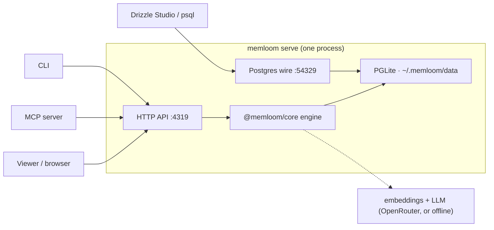

## The single-owner model

memloom's store is PGLite: real Postgres compiled to WASM, embedded in the daemon process,
with data in a plain folder. PGLite allows exactly **one** connection, so **`memloom serve`
is the single owner of the store, and every other surface is a client of the daemon.**



The daemon exposes the store two ways from one process: the HTTP API on `127.0.0.1:4319`
(which also serves the viewer bundle at `/`), and the raw Postgres wire protocol on
`127.0.0.1:54329` for database tools. Any CLI command auto-starts the daemon if it isn't
running; `memloom stop` shuts it down gracefully and releases the data-dir lock.

<Warning>
Because PGLite is single-connection, a connected wire client (Drizzle Studio, psql, an IDE
database panel) holds an exclusive lock and every API call queues behind it. The API detects
this and answers **503** within ~1.5 seconds instead of hanging; the `serve` terminal warns
when a wire client attaches. Disconnect the client to resume.
</Warning>

## Packages

| Package | Role |
| --- | --- |
| `@memloom/core` | The engine: belief pipeline, retrieval, graph, context ingestion, migrations, storage adapters, providers. No HTTP, no CLI, no `process.env`. |
| `@memloom/server` | A thin Hono HTTP layer over the engine. Validates requests, maps engine calls to routes, serves the viewer bundle. |
| `memloom` (CLI) | Commands + the daemon. Wires PGLite, config, and providers together and starts the server. |
| `@memloom/mcp` | MCP tools (`save_memory`, `recall_memory`, `memory_history`, `list_conflicts`, `resolve_conflict`) for agents. |
| `@memloom/viewer` | The browser UI (React). Built and baked into the CLI package, so the daemon serves it with no separate process. |

## The engine contract

Every surface programs against one interface, `MemoryEngine`:

```ts
interface MemoryEngine {
  save(input): Promise<SaveResult>;
  recall(query, opts?): Promise<Memory[]>;
  memories(): Promise<Memory[]>;          // browse (recall is for querying)
  update(input): Promise<UpdateResult>;   // new version of a belief
  history(memoryId): Promise<Memory[]>;   // the full version chain
  index(): Promise<IndexResult>;          // entity extraction → graph edges
  graph(): Promise<Graph>;
  conflicts() / resolveConflict() / revertConflict();
  contextAdd() / contextList() / contextChunks() / contextRemove();
}
```

Two implementations exist: `Memloom` (the real engine, in-process) and `HttpMemloomClient`
(the same interface over HTTP). The CLI and MCP use the HTTP client, which is why many
clients can share one store safely: they were never holding the store in the first place.

## Storage tiers

Storage is an adapter interface (`query`, `exec`, `tx`), with two implementations:

- **`PgliteAdapter`**: the embedded tier. What the daemon uses. Zero setup, data in a folder.
- **`PgAdapter`**: a real Postgres server over the wire (Docker, Supabase, any managed
  Postgres with pgvector). Available programmatically today; see
  [Self-hosting](/guides/self-hosting).

The schema is identical in both: memloom's migrations are plain SQL and its one stored
function (`memloom_fuse`) is `LANGUAGE sql` rather than plpgsql, so it runs identically on
PGLite and server Postgres.

## Design rules worth knowing

- **All config is injected.** Core never reads `process.env` or global state. The daemon is
  the only place environment/config is read, then everything is passed in as constructor
  arguments. This is why the whole engine is testable without a network.
- **The edge table has no foreign keys.** `memory_edges` links memories, entities, *and*
  context chunks in one table. Those are different node tables, so FKs are impossible by design. The
  trade: cascade deletes can't clean edges, so every chunk/memory removal path deletes its
  edges explicitly.
- **Nothing is destroyed.** Superseded memories go `status = 'stale'`, edges deactivate
  (`active = false`) rather than being deleted. This is what makes conflict resolution and
  versioning reversible.
- **Migrations are ordered and idempotent.** `Memloom.init()` runs pending migrations, then
  verifies the store's **embedding fingerprint**: a store embedded with one model refuses to
  open under another, because mixed vector spaces make similarity silently meaningless.

## Data layout

```
~/.memloom/            (override with MEMLOOM_HOME)
├── config.env         settings the daemon reads at startup
└── data/              the Postgres data directory, your memory. Copy it = backup.
```
