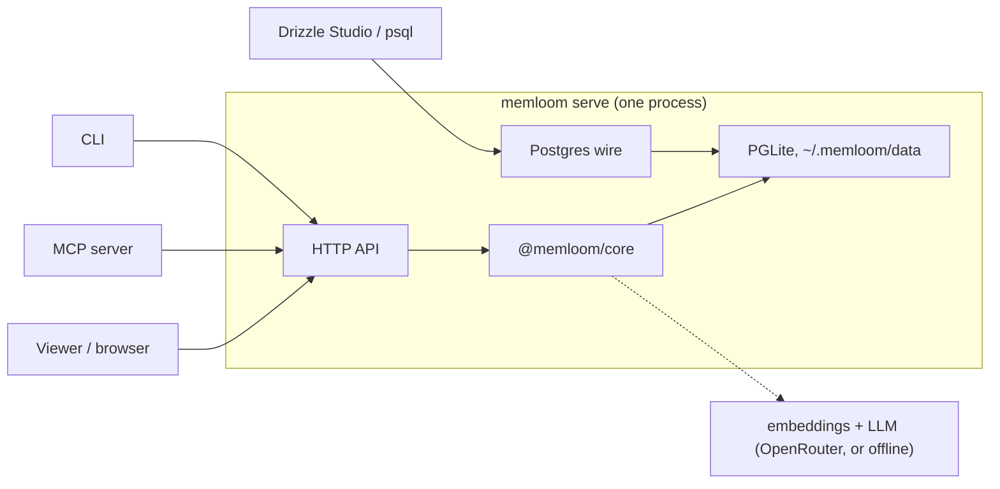

## Overview

The default store is PGLite: real Postgres compiled to WASM, embedded in the daemon, with data in
a plain folder. PGLite allows exactly one connection, so **`memloom serve` owns the store and
every other surface is a client**.


```mermaid
flowchart LR
    CLI[CLI] --> HTTP
    MCP[MCP server] --> HTTP
    Viewer[Viewer / browser] --> HTTP
    Studio[Drizzle Studio / psql] --> Wire
    subgraph daemon ["memloom serve (one process)"]
        HTTP["HTTP API"] --> Engine
        Wire["Postgres wire"] --> Store
        Engine["@memloom/core"] --> Store["PGLite, ~/.memloom/data"]
    end
    Engine -.-> Providers["embeddings + LLM (OpenRouter, or offline)"]
```

The daemon exposes the store two ways from one process: the HTTP API on `127.0.0.1:4319`, which
also serves the viewer, and the raw Postgres wire on `127.0.0.1:54329` for database tools. Any CLI
command starts it if it is not running.

<Warning>
  A connected wire client holds an exclusive lock, so every API call would queue behind it. The
  API detects this and answers **503** within about 1.5 seconds instead of hanging. Disconnect the
  database client to resume.
</Warning>

***

## Packages

| Package | Role |
| --- | --- |
| `@memloom/core` | The engine. Belief pipeline, retrieval, graph, ingestion, migrations. No HTTP, no CLI, no `process.env` |
| `@memloom/server` | A thin Hono layer over the engine. Validates requests, serves the viewer |
| `memloom` | Commands and the daemon. Wires storage, config and providers together |
| `@memloom/mcp` | The [MCP tools](/mcp/tools) for agents |
| `@memloom/viewer` | The React UI, baked into the CLI package so no separate process is needed |

***

## The engine contract

Every surface programs against one interface.

```ts
interface MemoryEngine {
  save(input): Promise<SaveResult>;
  recall(query, opts?): Promise<Memory[]>;
  memories(): Promise<Memory[]>;
  update(input): Promise<UpdateResult>;
  history(memoryId): Promise<Memory[]>;
  index(): Promise<IndexResult>;
  graph(): Promise<Graph>;
  conflicts() / resolveConflict() / revertConflict();
  contextAdd() / contextList() / contextChunks() / contextRemove();
}
```

Two implementations: `Memloom` in-process, and `HttpMemloomClient` over HTTP. The CLI and MCP use
the HTTP one, which is why many clients share one store safely. They were never holding it.

***

## Storage tiers

| Adapter | Tier | Selected by |
| --- | --- | --- |
| `PgliteAdapter` | Embedded, zero setup, data in a folder | Default |
| `PgAdapter` | A real Postgres server with pgvector, pooled | `MEMLOOM_PG_URL` |

The schema is identical. Migrations are plain SQL and the one stored function is `LANGUAGE sql`
rather than plpgsql, so it runs the same on both. See [Self-hosting](/guides/self-hosting).

***

## Rules worth knowing

<CardGroup cols={2}>
  <Card title="Config is injected" icon="syringe">
    Core never reads `process.env`. The daemon is the only place config is read, then everything is
    passed in. That is why the engine is testable without a network.
  </Card>
  <Card title="Nothing is destroyed" icon="shield">
    Superseded memories go stale and edges deactivate rather than being deleted. That is what makes
    versioning and conflict resolution reversible.
  </Card>
  <Card title="No foreign keys on edges" icon="link-slash">
    One edge table links memories, entities and chunks, which are different node tables. Every
    delete path removes its own edges explicitly.
  </Card>
  <Card title="Vectors are fingerprinted" icon="fingerprint">
    A store embedded with one model refuses to open under another, because mixed vector spaces
    make similarity silently meaningless.
  </Card>
</CardGroup>

## Data layout

```
~/.memloom/            (override with MEMLOOM_HOME)
├── config.env         settings the daemon reads at startup
└── data/              your memory. Copy it to back it up.
```
