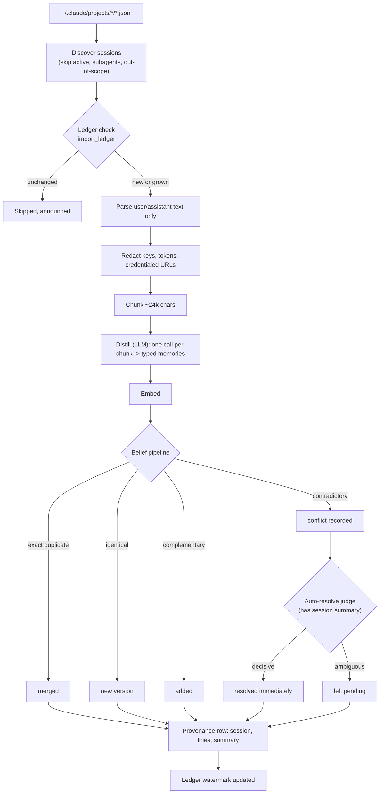

## What distillation is

Every Claude Code session on your machine is a JSONL session under
`~/.claude/projects`. `memloom import sessions` and `memloom connect claude-code` both
turn those sessions into memories through the same pipeline: read, redact, chunk, ask
the LLM to extract what's worth keeping, dedup against what you already have, and save. The
two commands differ only in trigger: `import` runs the pipeline on demand over a scope of
past sessions, `connect` installs a Claude Code session-end hook so the pipeline runs once,
automatically, right after each session finishes.

## The pipeline

## Discovery and the quiet window

A session only qualifies if its file is a UUID-named main transcript (subagent sidecars are
named differently and are skipped outright) and it falls inside the requested window
(`--days`, default 14) and cap (`--sessions`, default 20). A session modified in the last 5
minutes is treated as still being written and skipped for this run; it picks up on the next
one. Anything left out is reported, never silently dropped.

## Parsing: what survives, what doesn't

Only `user` and `assistant` text is kept. Dropped before the LLM ever sees it:

- Tool calls and tool results (`tool_use`/`tool_result` blocks)
- Subagent turns mirrored into the parent transcript (`isSidechain`)
- Meta lines and slash-command noise
- Compaction summaries, so a resumed session doesn't re-teach the model its own recap

Each surviving line keeps its line number, which is what makes provenance possible later.

## Redaction

Before a unit of text leaves your machine, it passes through a regex-based scrub for
secret-shaped strings: JWTs, vendor API key formats, `KEY=value` assignments, and
credentialed URLs. This runs on every unit, not just ones bound for the LLM, because the
same redacted text is what gets stored as the memory's excerpt. Redaction is pattern-based
and best-effort by design; review sensitive sessions with `--dry-run` and the viewer rather
than trusting it as a hard boundary.

## Chunking and distillation

Units are packed into chunks up to ~24,000 characters, each line still tagged with its
original number. One LLM call per chunk asks for typed memories in memloom's existing
taxonomy (`fact`, `preference`, `episode`, `procedure`, see
[Memory types](/concepts/memory-types)), each with a `[startLine, endLine]` range. The
prompt treats the transcript as **untrusted data**: instructions found inside a fetched
page or a tool's output are not instructions to the distiller, they're just text a
transcript happens to contain. Output that doesn't parse into a known type, or that's
empty or oversized, is dropped and counted, never saved as noise.

## Belief pipeline and conflicts

Distilled memories go through the same belief pipeline as anything saved by hand: exact
duplicates merge by content hash, near-duplicates are classified by the dedup LLM call as
identical (new version), complementary (added as its own belief), or contradictory
(conflict recorded, both stay active). See [Conflicts](/concepts/conflicts) for the general
mechanism.

Import gets one extra step. Because a distilled memory carries a transcript excerpt as
context, a contradictory save also gets judged once, immediately, by an LLM that reads that
excerpt: a decisive verdict resolves the conflict right there, an ambiguous one leaves it
pending in `memloom conflicts` and the viewer like any other. Nothing here bypasses your
review; it only saves you from resolving conflicts a transcript already answered.

## Provenance

Every memory that comes out of import, whatever it merged, versioned, or added into, gets a
provenance row: the session file, the line range, and the redacted excerpt it was distilled
from. A recall result traces back to the exact conversation it came from.

## Idempotency

`import_ledger` tracks, per session, how far it was processed: a line offset and a content
hash of everything read up to that point.

| State | What happens |
| --- | --- |
| Offset ≥ current line count, hash matches | Skipped, nothing to do |
| File grew | Resumes from the watermark, re-reading the last 40 lines first for context continuity, so the new chunk isn't distilled without the conversation that led into it |
| Hash mismatch | The file was rewritten (Claude Code compaction, or a resumed session renumbering earlier content), so it's reprocessed from the start |

This is what makes `import sessions` cheap to re-run: an unchanged session costs one
ledger lookup, not one LLM call.

## Continuous capture

`memloom connect claude-code` runs the identical pipeline, triggered differently: a
session-end hook hands the daemon a single file path the moment Claude Code exits, and
the import pipeline runs against just that path, skipping discovery. It's still bounded: a
daily cap on unattended distillation calls means a runaway loop of sessions can't spend
your LLM budget silently, and `memloom status` says so loudly when the cap is hit. See
[Import](/cli/import) for the flags and setup.
