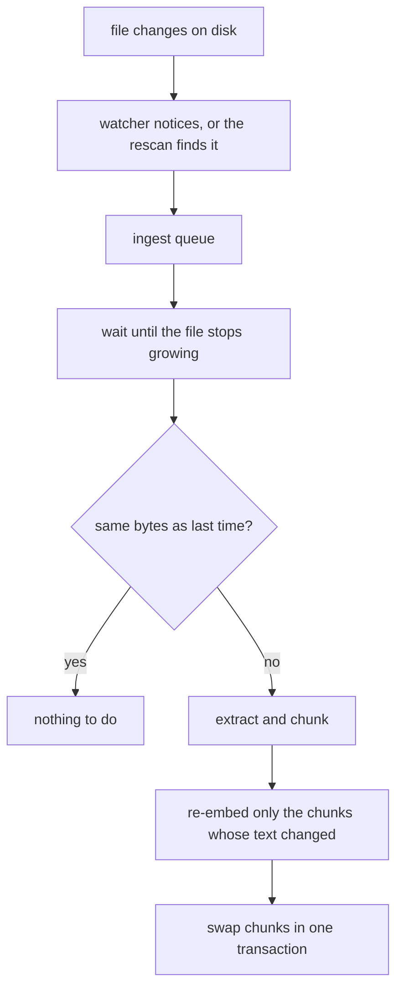

## Overview

```bash
memloom context add ~/recordings   # links the folder and starts watching it
memloom context roots              # what is watched, and when it was last checked
```

Link a folder and memloom follows it. Edit a file and recall reflects the edit within seconds. Drop
a new recording in and it gets transcribed and becomes recallable without anyone adding it.

<CardGroup cols={3}>
  <Card title="On by default" icon="eye">
    Linking is asking for something to stay current. Switch it off per folder or per file.
  </Card>
  <Card title="Only what changed" icon="scissors">
    An edited section is re-embedded. The untouched ones keep their vectors and their entity links.
  </Card>
  <Card title="Deleting never forgets" icon="shield">
    A file that disappears is marked, not erased. Its chunks stay recallable.
  </Card>
</CardGroup>

***

## What gets watched

| Added as | Watched |
| --- | --- |
| A folder, from the CLI, the viewer, or MCP | Yes, and files that appear in it later |
| A single file linked from disk | Yes |
| An upload from the browser dialog | No, there is no path to watch |
| A chat attachment | No |
| A web page | No, use Notion sync or re-add the page |

Folders recurse five levels and skip hidden, `node_modules`, `dist`, `build`, `__pycache__` and
`target`.

***

## How a change reaches recall



Two mechanisms, because neither is enough alone.

**Events** are immediate and cost nothing while idle, but they never arrive for a file that landed
while the daemon was down, and network shares drop them even while it is up.

**A rescan** walks every watched folder about once a minute. It is the safety net: a dropped event
costs a minute, not the file. To keep it cheap it only looks at entries modified since the last
pass, plus anything the store has never seen, which is how a folder copied in with its original
timestamps is still noticed.

<Note>
  Nothing is read or transcribed by the watcher itself. Every path found goes to the same ingest
  queue that a manual add uses, so a file still being copied is waited out, work runs one at a time,
  and progress and cancel work exactly as before. See [Recordings](/guides/recordings).
</Note>

***

## Recording into a watched folder

The case this exists for: a device that writes an audio file into a folder every minute.

<Steps>
  <Step title="Set up transcription once">
    ```bash
    memloom audio setup
    ```
  </Step>
  <Step title="Link the folder, empty or not">
    ```bash
    memloom context add ~/dropbox/recorder
    ```
    Anything already in it is ingested, and the folder goes on the watch list. An **empty folder
    is fine and expected**: make the folder, link it, then point the recorder at it.
  </Step>
  <Step title="Leave it">
    Each new file is queued, transcribed, and recallable. `memloom context roots` shows the count
    and the last check.
  </Step>
</Steps>

An hour of audio takes 8 to 11 minutes to transcribe, so a folder receiving files faster than that
builds a backlog. The queue drains in order and reports it; nothing is dropped.

<Warning>
  A first link stops at 500 files, so a mistyped path cannot run away. The response says when it
  trimmed. Rescans of a folder already being watched are unbounded, so a folder that grows past 500
  keeps working.
</Warning>

***

## Turning it off

| | |
| --- | --- |
| One folder | `memloom context unwatch <folder>`, or **Stop watching** in the documents tab |
| One file inside a watched folder | `memloom context unwatch <file>` |
| Drop a folder from the list | `memloom context forget <folder>`, its documents stay |
| The whole feature | `MEMLOOM_SYNC=off` in `~/.memloom/config.env` |

Switching watching off changes nothing that was already learned, and switching it back on
re-checks the folder on the next pass.

<Accordion title="Environment knobs, rarely needed" icon="sliders">
  | Variable | Effect |
  | --- | --- |
  | `MEMLOOM_SYNC` | `off` disables watching entirely. Folders are still recorded |
  | `MEMLOOM_SYNC_RESCAN_MS` | Rescan interval. Default 60000, floor 10000 |
  | `MEMLOOM_SYNC_POLL` | `on` forces polling instead of OS events, `off` forbids it, `auto` (default) polls only UNC paths |

  Polling is worth forcing when a watched folder lives on a mapped network drive, where OS events
  often never arrive. The rescan covers that case anyway, one interval later.
</Accordion>

***

## Missing files

A file that disappears is marked **file missing** in the documents tab. Its chunks stay
recallable, because the ordinary causes are a temp-file rename, an unmounted drive, and a pipeline
that tidies up after itself, and none of them mean you wanted to forget what the file said.

If the file comes back, the mark clears and the file is re-read. To delete the memory as well,
remove the document.

## Known limits

- A file edited while the daemon is down and restored to an older timestamp is only noticed if its
  path is new to the store.
- Renaming a file arrives as a delete plus an add, so the old document stays marked missing until
  you remove it.
- Cloud-drive placeholder files (OneDrive on-demand, for one) are read only once the OS hydrates
  them.
- Watching follows paths as stored. Linking the same folder twice under different letter case makes
  two roots.
