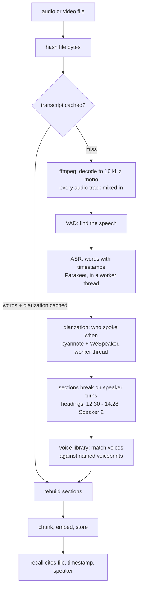

Add a recording like any other file: `memloom context add meeting.mkv`, the viewer's
**Link file** button, or the MCP `add_file` tool. Everything below happens on your
machine. No audio, video, or transcript ever leaves it.

```bash
memloom audio setup     # one-time: fetch the speech + speaker models (~500 MB)
memloom context add "D:\recordings\standup 2026-07-30.mkv"
```

## The pipeline



Two stages dominate the cost: transcription runs at roughly a tenth of real time on a
recent CPU, diarization at roughly half. Both run in a worker thread, so the daemon keeps
answering while an hour-long video processes. Progress is reported per stage, including a
live percentage while "telling the voices apart."

## The queue

Recordings never transcribe inside a request. Linking one file or fifty enqueues them;
the queue runs one at a time (a recognizer holds about 1 GB), reports per-file progress
with cancel and resume, survives daemon restarts, and uploaded bytes are stored in
memloom's own uploads directory so playback and samples keep working. Files over about
512 MB must be linked rather than uploaded; linking is better for any large recording,
since a linked file can be re-scanned from disk later.

## Transcripts are cached twice

The transcript cache stores the transcribed words and the diarization result under
separate keys, both keyed to the file's content hash. Re-adding an unchanged recording is
free; changing diarization settings (or installing the speaker models later) reprocesses
only the minutes-long diarization against the cached words, never the much longer
transcription.

## Speakers

With the speaker models installed (fetched by `memloom audio setup`), multi-voice
recordings get diarized: sections break where the speaker changes, and headings carry the
label, so recall cites `from standup.mkv > 12:30 - 14:28, Speaker 2`. Single-voice
recordings stay unlabeled on purpose.

In the viewer's documents tab, every recording shows its speakers with a playable voice
sample and inline rename. Renaming rewrites only the transcript's headings and
breadcrumbs, never the spoken words.

**The voice library.** Every diarized voice gets a compact numeric voiceprint (an
embedding; no audio is stored) on the document. Name a voice once and later recordings of
the same voice arrive pre-named: each new recording's voices are compared against every
named voiceprint, and a confident match is renamed automatically. Each confirmed
recording adds another print for that person, which makes the next match more reliable.
Voices with under ten seconds of talk are never auto-named, and a wrong auto-name is
fixed by renaming; the manual name always wins.

## Choosing a speech model

`memloom audio models` lists the catalog: Parakeet v3 is the default (25 European
languages), with smaller and Asian-language alternatives. `memloom audio use <id>`
switches; transcripts are cached per model, so switching back costs nothing.

## Tuning knobs (rarely needed)

| Env | Effect |
| --- | --- |
| `MEMLOOM_DIARIZE_SPEAKERS` | Pin the speaker count when you know it |
| `MEMLOOM_DIARIZE_THRESHOLD` | Clustering cutoff; smaller finds more speakers (default 0.6) |
| `MEMLOOM_VOICE_MATCH_THRESHOLD` | Auto-naming similarity bar (default 0.8) |
| `MEMLOOM_ASR_MODEL` | Pin a speech model for one run |

## Known limits

Very short clips with only seconds per voice can merge two speakers (their voiceprints
are too noisy to separate). Overlapping speech is attributed to one speaker. ffmpeg must
be on PATH. Corrupted stretches in a recording are skipped by the decoder and can degrade
diarization around them.
