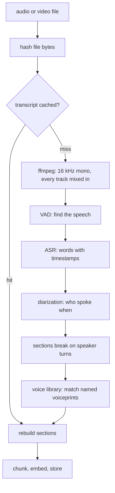

## Overview

```bash
memloom audio setup     # one-time: fetch the speech and speaker models, about 500 MB
memloom context add "standup 2026-07-30.mkv"
```

Add a recording like any other file, from the CLI, the viewer's **Link file** button, or the MCP
`add_file` tool.

<CardGroup cols={3}>
  <Card title="Entirely on-device" icon="lock">
    No audio, video or transcript leaves your machine.
  </Card>
  <Card title="Cited by timestamp" icon="clock">
    Recall says `from standup.mkv > 12:30 - 14:28, Speaker 2`.
  </Card>
  <Card title="Learns voices" icon="user-check">
    Name a voice once and later recordings of the same person arrive pre-named.
  </Card>
</CardGroup>

***

## The pipeline



Transcription runs at roughly a tenth of real time on a recent CPU, diarization at roughly half.
Both run in a worker thread, so the daemon keeps answering while an hour-long video processes.

***

## The queue

Recordings never transcribe inside a request. Linking one file or fifty enqueues them.

| | |
| --- | --- |
| One at a time | A recognizer holds about 1 GB |
| Per-file progress | With cancel and resume |
| Survives restarts | The queue is in the store |
| Uploads are kept | In memloom's own directory, so playback and samples keep working |

<Note>
  Files over about 512 MB must be linked rather than uploaded. Linking is better for any large
  recording, since a linked file can be re-scanned from disk later.
</Note>

***

## Speakers

With the speaker models installed, recordings are diarized: sections break where the speaker
changes and every heading carries the label, one voice or ten.

A section breaks on a change of speaker only once the current speaker has said enough to be worth
finding on its own. A back-channel ("Yeah", "Oh") rides along with the speech around it, which is
how a person reads a transcript. Without that floor each one became its own chunk, and since a
chunk's text opens with its own heading, two words of speech sat under twenty characters of
`25:46 - 25:47, Alice`. Those chunks embed as mostly the speaker's NAME, so they beat the
passage that actually answers a question about that person.

The documents tab shows every recording's speakers with a playable sample and inline rename.
Renaming rewrites only headings and breadcrumbs, never the spoken words.

**The voice library.** Each diarized voice gets a numeric voiceprint on the document, with no
audio stored. Name a voice once and every later recording is compared against your named prints,
renaming a confident match automatically. Each confirmation adds another print, which makes the
next match better.

<Warning>
  Voices with under ten seconds of talk are never auto-named, because a short sample's print is
  noise. A wrong auto-name is fixed by renaming, and the manual name always wins.
</Warning>

***

## Models and tuning

```bash
memloom audio models      # the catalog
memloom audio use <id>    # switch
```

Parakeet v3 is the default, covering 25 European languages, with smaller and Asian-language
alternatives. Transcripts are cached per model, so switching back costs nothing.

<Accordion title="Environment knobs, rarely needed" icon="sliders">
  | Variable | Effect |
  | --- | --- |
  | `MEMLOOM_VAD_THRESHOLD` | How sure the detector must be that a frame is speech, 0 to 1. Default 0.5 |
  | `MEMLOOM_DIARIZE_SPEAKERS` | Pin the speaker count when you know it |
  | `MEMLOOM_DIARIZE_THRESHOLD` | Clustering cutoff. Smaller finds more speakers. Default 0.6 |
  | `MEMLOOM_VOICE_MATCH_THRESHOLD` | Auto-naming similarity bar. Default 0.8 |
  | `MEMLOOM_ASR_MODEL` | Pin a speech model for one run |

  Words and diarization are cached under separate keys, both by content hash. Changing a
  diarization setting reprocesses only the minutes-long diarization against the cached words,
  never the much longer transcription.
</Accordion>

## Switching language mid-recording

The speech model picks a language per decode call, and a call holding two of them commits to the
first. Say a sentence in English and the next in Russian inside the same minute and the Russian
came back empty, with no error: the words simply stopped at the switch.

A chunk whose transcript ends while its speech carries on is now repacked into smaller pieces and
decoded again, which is enough for each piece to hold one language. Measured on a one-minute
recording that switched half way: 0 Cyrillic characters before, 203 after, with the English
unchanged. Only the chunk that needs it pays for the second pass, so a single-language recording
costs nothing.

<Note>
  This is also why the check does not compare a chunk against its neighbours: a one-minute
  recording is a single chunk, which is exactly what an always-on wearable writes, and there is
  nothing to compare it with.
</Note>

***

## When there is background noise

Voice detection runs first, to skip silence so an hour with ten minutes of talking decodes ten
minutes rather than sixty. It is an optimization, not a gate, so being wrong about where speech
is never costs the recording:

<Steps>
  <Step title="A second pass at a lower bar">
    Speech under continuous loud audio never reaches the default threshold, because the detector
    sees a busy frame and the voice is a small part of its energy. Finding nothing triggers one
    more pass at 0.3. It costs another 0.6% of real time.
  </Step>
  <Step title="Then the whole file, if it is short">
    Still nothing, and the file is not silent? Everything goes to the recognizer, which is a
    600M-parameter speech model against the detector's 632 KB and a better judge of what it is
    hearing. Skipped above ten minutes, since by this point the odds are poor and an hour of
    music would cost 8 to 11 minutes of CPU to return nothing.
  </Step>
  <Step title="Refused only when there is nothing to keep">
    A silent file, one too long for the fallback, or one the recognizer turns into no words at
    all, is refused with the reason. Storing a document whose only chunk is "Recorded on ..."
    would be worse than saying so.
  </Step>
</Steps>

<Note>
  Background music does not by itself defeat transcription. Mixing music under a voice note at
  0.7 of the speech level still transcribed completely, with a few words wrong. What fails is
  speech buried far below the background, where the features stop resembling speech at all.
</Note>

<Warning>
  Pulling a voice out from under louder music needs a source-separation model, which is a
  different thing from a speech recognizer and not something memloom carries. A denoiser is not a
  substitute: sherpa's GTCRN enhancement made the same clip WORSE in testing, cutting the
  transcript short and inventing words, because it is trained on speech plus steady noise and
  music is neither.
</Warning>

## Known limits

- Very short clips with seconds per voice can merge two speakers.
- Overlapping speech is attributed to one speaker.
- A section that absorbed a back-channel contains a word or two from another voice. It is labeled
  with whoever said most of it, which is the honest attribution but not a perfect one.
- ffmpeg must be on PATH.
- Corrupted stretches are skipped by the decoder and can degrade diarization around them.
