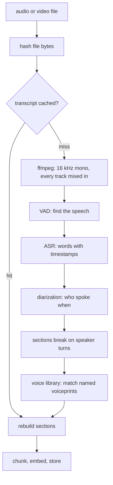

## Overview

```bash
memloom audio setup     # one-time: fetch the speech and speaker models, about 500 MB
memloom context add "standup 2026-07-30.mkv"
```

Add a recording like any other file, from the CLI, the viewer's **Link file** button, or the MCP
`add_file` tool.

<CardGroup cols={3}>
  <Card title="Entirely on-device" icon="lock">
    No audio, video or transcript leaves your machine.
  </Card>
  <Card title="Cited by timestamp" icon="clock">
    Recall says `from standup.mkv > 12:30 - 14:28, Speaker 2`.
  </Card>
  <Card title="Learns voices" icon="user-check">
    Name a voice once and later recordings of the same person arrive pre-named.
  </Card>
</CardGroup>

***

## The pipeline



Transcription runs at roughly a tenth of real time on a recent CPU, diarization at roughly half.
Both run in a worker thread, so the daemon keeps answering while an hour-long video processes.

***

## The queue

Recordings never transcribe inside a request. Linking one file or fifty enqueues them.

| | |
| --- | --- |
| One at a time | A recognizer holds about 1 GB |
| Per-file progress | With cancel and resume |
| Survives restarts | The queue is in the store |
| Uploads are kept | In memloom's own directory, so playback and samples keep working |

<Note>
  Files over about 512 MB must be linked rather than uploaded. Linking is better for any large
  recording, since a linked file can be re-scanned from disk later.
</Note>

***

## Speakers

With the speaker models installed, recordings are diarized: sections break where the speaker
changes and every heading carries the label, one voice or ten.

A section breaks on a change of speaker only once the current speaker has said enough to be worth
finding on its own. A back-channel ("Yeah", "Oh") rides along with the speech around it, which is
how a person reads a transcript. Without that floor each one became its own chunk, and since a
chunk's text opens with its own heading, two words of speech sat under twenty characters of
`25:46 - 25:47, Alice`. Those chunks embed as mostly the speaker's NAME, so they beat the
passage that actually answers a question about that person.

The documents tab shows every recording's speakers with a playable sample and inline rename.
Renaming rewrites only headings and breadcrumbs, never the spoken words.

**The voice library.** Each diarized voice gets a numeric voiceprint on the document, with no
audio stored. Name a voice once and every later recording is compared against your named prints,
renaming a confident match automatically. Each confirmation adds another print, which makes the
next match better.

<Warning>
  Voices with under ten seconds of talk are never auto-named, because a short sample's print is
  noise. A wrong auto-name is fixed by renaming, and the manual name always wins.
</Warning>

***

## Models and tuning

```bash
memloom audio models      # the catalog
memloom audio use <id>    # switch
```

Parakeet v3 is the default, covering 25 European languages, with smaller and Asian-language
alternatives. Transcripts are cached per model, so switching back costs nothing.

<Accordion title="Environment knobs, rarely needed" icon="sliders">
  | Variable | Effect |
  | --- | --- |
  | `MEMLOOM_DIARIZE_SPEAKERS` | Pin the speaker count when you know it |
  | `MEMLOOM_DIARIZE_THRESHOLD` | Clustering cutoff. Smaller finds more speakers. Default 0.6 |
  | `MEMLOOM_VOICE_MATCH_THRESHOLD` | Auto-naming similarity bar. Default 0.8 |
  | `MEMLOOM_ASR_MODEL` | Pin a speech model for one run |

  Words and diarization are cached under separate keys, both by content hash. Changing a
  diarization setting reprocesses only the minutes-long diarization against the cached words,
  never the much longer transcription.
</Accordion>

## Known limits

- Very short clips with seconds per voice can merge two speakers.
- Overlapping speech is attributed to one speaker.
- A section that absorbed a back-channel contains a word or two from another voice. It is labeled
  with whoever said most of it, which is the honest attribution but not a perfect one.
- ffmpeg must be on PATH.
- Corrupted stretches are skipped by the decoder and can degrade diarization around them.
